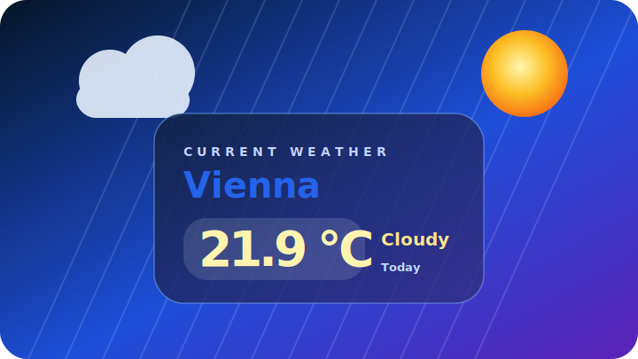

# Shortcuts

Public Apple Shortcuts with clear releases, privacy notes, and reproducible files.

Deutsch: [README.de.md](README.de.md)

This repository is a collection. Each shortcut lives completely in its own
folder below `shortcuts/`, so future shortcuts can be released independently.

## Available Shortcuts

| Preview | Shortcut | Version | Folder | Release |
| --- | --- | --- | --- | --- |
|  | Weather for City | 1.2.2 | [`shortcuts/weather-for-city`](shortcuts/weather-for-city/) | [`Install`](https://www.icloud.com/shortcuts/d5eed8a950494a799b8a3ec0d268ac4c), [`v1.2.2`](https://github.com/Schrotty74/Shortcuts/releases/tag/v1.2.2) |

## Current Highlights

- bilingual public shortcut documentation in English and German
- compact preview image for every published shortcut entry
- per-shortcut privacy reports, checksums, signed shortcut files, and ZIP
  downloads
- update-ready release structure for multiple independent shortcuts

For `Weather for City`:

- animated weather card with responsive layouts for Mac and iPhone
- city lookup with location picker for ambiguous results
- current weather through public Open-Meteo APIs, without an API key
- Celsius or Fahrenheit selected from the found city's country
- German UI for `de-AT`, `de-DE`, `de-CH`, `de-LI`; English fallback elsewhere
- built-in update check against the latest GitHub release

## Privacy

Each published shortcut includes its own privacy report in the shortcut folder.

For `Weather for City`:

[`shortcuts/weather-for-city/PRIVACY_REPORT.md`](shortcuts/weather-for-city/PRIVACY_REPORT.md)

## Release Status

The GitHub Action checks the published structure, checksums, ZIP files, and
basic privacy indicators.
