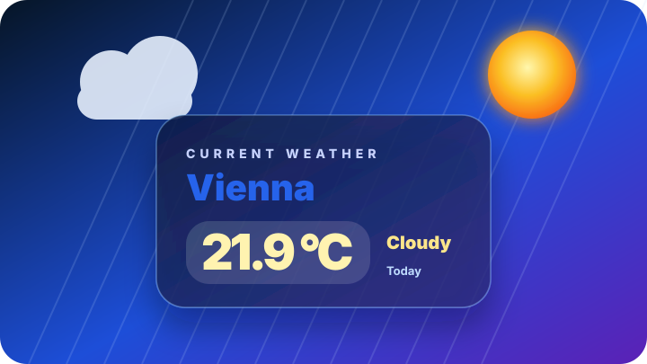

# Apple Shortcuts Collection – Privacy-Focused iPhone & Mac Shortcuts

A public collection of Apple Shortcuts for iPhone, iPad and Mac with clear releases, privacy notes, checksums and reproducible files.

Deutsch: [README.de.md](README.de.md)

Each Apple Shortcut lives in its own folder under `shortcuts/` so it can be documented and released independently.

## Available Apple Shortcuts

| Preview | Shortcut | Version | Folder | Release |
| --- | --- | --- | --- | --- |
|  | Weather for City | 1.2.3 | [`shortcuts/weather-for-city`](shortcuts/weather-for-city/) | [`Install`](https://www.icloud.com/shortcuts/27ee79aa7dd0427babb6758cef78c06b), [`v1.2.3`](https://github.com/Schrotty74/Shortcuts/releases/tag/v1.2.3) |

## Weather for City

A privacy-conscious Apple weather shortcut for iPhone and Mac with an animated weather card, saved city selection and current weather from Open-Meteo without an API key.

- Responsive layouts for Mac and iPhone
- Saved selected-location reuse
- Separate Change City action
- Location picker for ambiguous city searches
- Celsius or Fahrenheit based on the selected city's country
- German UI for `de-AT`, `de-DE`, `de-CH`, `de-LI`; English fallback elsewhere
- Built-in update check against the latest GitHub release

## Privacy

Each published shortcut includes its own privacy report. For Weather for City see [`shortcuts/weather-for-city/PRIVACY_REPORT.md`](shortcuts/weather-for-city/PRIVACY_REPORT.md).
